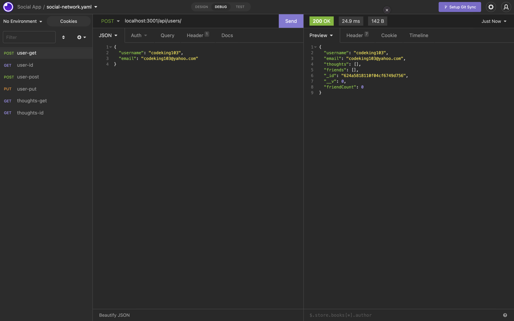

# Social-Network-API

## Description 

The Social Network API is a backend web application that allows users to access & use MongoDB, Mongoose an objecting modeling tool helps the user work in an asynchronous environment.The user has the ability to make GET, POST, PUT & DELETE request with the social network API app. 

## Table of Contents 

* [Installation](#installation)
* [Usage](#usage)
* [Credits](#credits)
* [License](#license)

## Installation

- Node.js is needed to run application
- Install npm using command lines (npm install)
- Install mongoose (npm install mongoose)
- Install express (npm install express )
- Install nodemon to keep server running to view live changes (npm install nodemon)

## Usage 

To watch app demo please click here [https://loom.com/share/73f1c9cac0a442bc88a650e9344043ea]

## License

- No licenses were used

## Contribution
- Reggie Tenkorang

## Tests

No test were performed. 
